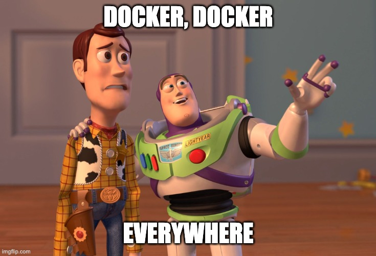

# Dockerize DataScience

> Bring your Data Science tasks to Docker! :whale:

[](https://medium.com/)
[](./LICENSE)



This is the code repository for the accompanying Medium article [_"How to Dockerize DataScience"_](https://medium.com/).

## Installation

Add the content of [`dockerize-datascience.sh`](dockerize-datascience.sh) to your `.bashrc` or `.zshrc` file.

## Usage

### Python

Choose your Python version:

| Python version | Command      |
| -------------: | ------------ |
|            3.8 | `python3.8`  |
|            3.9 | `python3.9`  |
|           3.10 | `python3.10` |
|         latest | `python`     |

This will run your python script or your interactive Python session in a _Docker container_. The current directory is mounted into the container.
If you want to install dependencies, you should use the _Python environment_.

### Python environment

In order to create a new or use an existing Python environment, run one of the following commands in your _project folder_:

| Python version | Command      |
| -------------: | ------------ |
|            3.8 | `pyenvd3.8`  |
|            3.9 | `pyenvd3.9`  |
|           3.10 | `pyenvd3.10` |
|         latest | `pyenvd`     |

The current directory is mounted into the container.

To delete the environment run `jupyterenvd_del` in your project folder.

### Jupyter (JupyterLab)

For [Jupyter](https://jupyter.org/) run

```shell
jupyter
```

This uses the [`datascience-ultimate`](https://github.com/FranzDiebold/docker-datascience-ultimate) Docker image.

The current directory is mounted into the container.

If you want to install dependencies, you should use the Jupyter environment\_.

### Jupyter environment

In order to create a new or use an existing Jupyter environment, run the following command in your _project folder_:

```shell
jupyterenvd
```

or shorter

```shell
jed
```

This uses the [`datascience-ultimate`](https://github.com/FranzDiebold/docker-datascience-ultimate) Docker image.

The current directory is mounted into the container.

To delete the environment run `jupyterenvd_del`.
